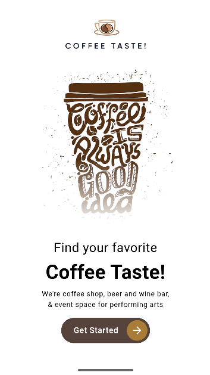
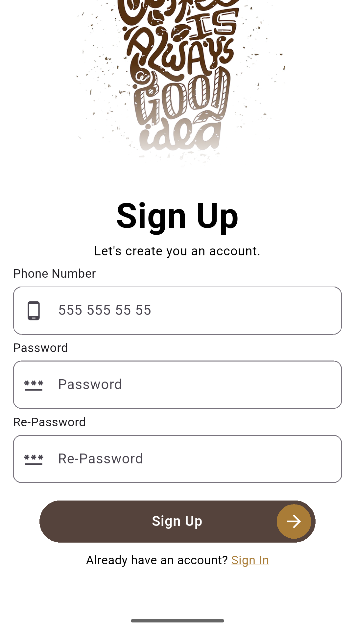

# ☕ Coffee App 
Bu proje, Flutter kullanılarak geliştirilen bir mobil uygulamadır. Sadece arayüz üzerine odaklanılarak yapılmış bir projedir. 

## 🧭 Kullanılan Teknolojiler

- Flutter
- Go Router
- RiverPod
- Gap

## 📱 Ekranlar
Projede sadece aşağıdaki ekranlar bulunmaktadır:
- Karşılama Ekranı
- Giriş Ekranı
- Kayıt Ekranı

## 📸 Ekran Görüntüleri

  
